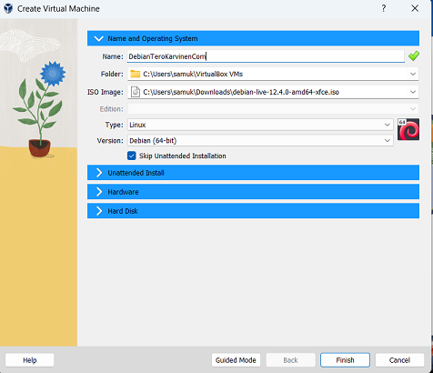

# h1 Oma Linux

x) Hyvän raportin ominaisuuksia:
   - täsmällinen
   - helppo lukea (kielenkäyttö huolellista, väliotsikoita käytetty)
   - tärkeää raportoida myös odottamattomat/vika tilanteet 
   - lähteisiin viittaaminen oikein
   - ei plagiointia

 FSF:Free Software Definition(suomeksi vapaa ohjelmisto):
 - vapaan ohjelmiston neljä perusvapautta:
   - Käyttäjä saa käyttää ohjelmistoa miten haluaa ja mihin tarkoitukseen haluaa (vapaus 0)
   - Käyttäjä saa tutkia ohjelman toimintaa sekä halutessaan muokata sitä omien tarpeiden mukaiseksi (vapaus 1)
   - Ohjelmasta saa tehdä kopioita sekä jakaa niitä edelleen (vapaus 2)
   - Ohjelman kopioita saa sekä muokattuja versioita saa jakaa muille, jotta niistä on hyötyä koko yhteisölle (vapaus 3)
 
 - Vapaa ohjelmisto ei tarkoita välttämättä ilmaista ohjelmistoa
 - Vapaa ohjelmisto ei tarkoita samaa kuin avoimen lähdekoodin ohjelmisto

## a) Raportti H1-Oma Linux
Tätä tehtävää varten asensin uuden linux virtuaalikoneen. Ensiksi latasin uusimman Debian ISO-image tiedoston sekä asensin Oracle VirtualBox ohjelman virtuaalikoneen asentamista varten. Virtuaalikoneelle annoin kuvan mukaiset asetukset eli käyttöjärjestelmäksi linux, versioksi 64-bittinen Debian, ram-muistin määräksi 4gb sekä kovalevyn kooksi 60gb:

Seuraavaksi asensin Debianin virtuaalikoneen työpöydältä löytyvästä Install Debian - painikkeesta. Asennuksessa oli hyvä vaihtaa näppäimistö Suomeksi, jotta kaikki kirjaimet toimivat niinkuin pitääkin. Tärkeää oli myös tyhjentää virtuaalilevy, jotta mitään edellisiä/ylimääräisiä asioita ei jäänyt: 

Tietokonetta nimettäessä oli tärkeää, että nimi ei sisällä omaa taikka esimerkiksi koulun nimeä. Myös salasanan tuli olla tarpeeksi vahva. Debianin onnistuneen asennuksen jälkeen testasin, että esimerkiksi internetselain toimii niinkuin pitää ja se toimikin:

Viimeiseksi päivitin kaiken komentorivillä komentoa "$ sudo apt-get -y dist-upgrade" käyttäen sekä asensin palomuurin:

 ## Lähteet

 https://www.gnu.org/philosophy/free-sw.html 
 https://terokarvinen.com/2006/raportin-kirjoittaminen-4/ 
 https://fi.wikipedia.org/wiki/Vapaa_ohjelmisto 
